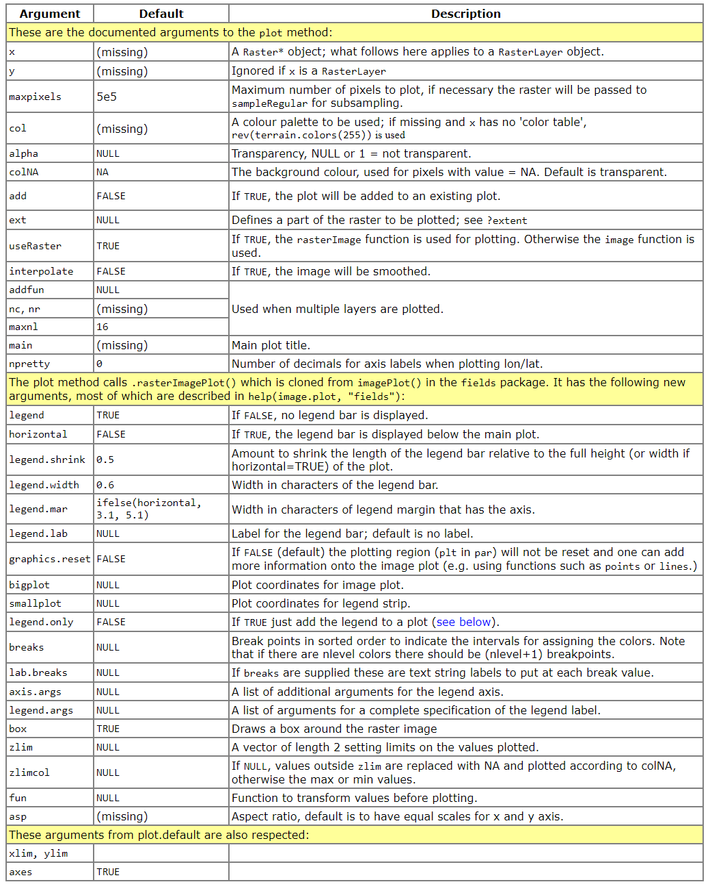
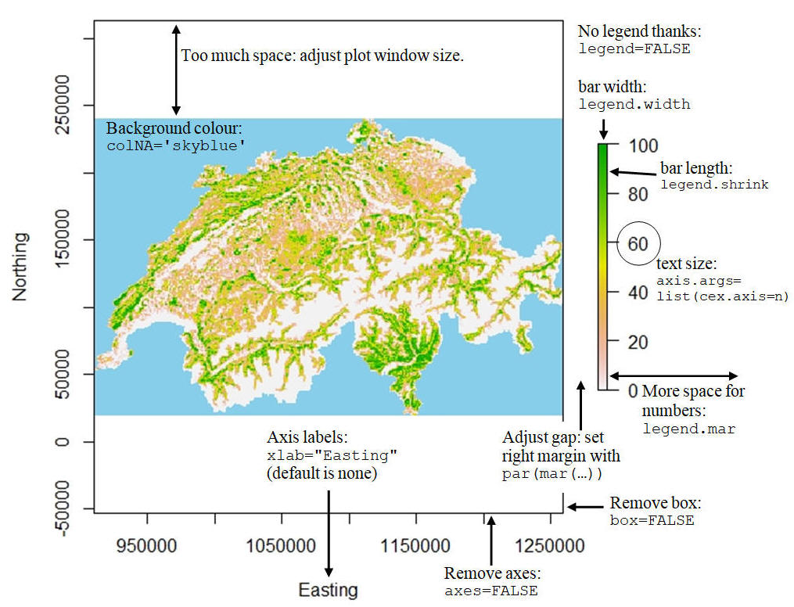

# Notes for R plots

## Plotting rasters using `raster` package

This section refered [this website](https://mmeredith.net/blog/2019/plotting_rasters.htm)

### Arguments for plotting rasters

The arguments used in `raster` package's `plot` function:

Common tweaks:

The `plot` function also supports:
- Horizontal legend bar
- Zooming in to an extent of the raster
- Interpolation of the raster plot
- Use `zlim` to plot several raster images with the same scale and a single legend

Additionally, `rasterVis` package provides useful raster plotting functions (check [this website](https://oscarperpinan.github.io/rastervis/)).

